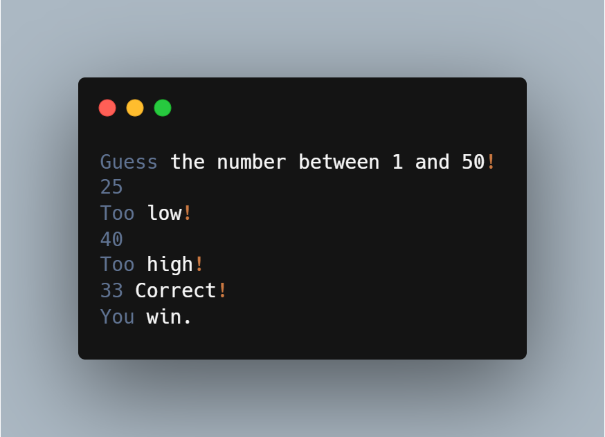

<div align="center"> 


# Number Guessing Game

<p align="center">


</p>

A beginner-friendly Java console application where the player tries to guess a randomly generated number between **1 and 50**.

</div>

---

## Tech Stack

- Java

---

## How It Works

1. The program generates a random number between **1 and 50**.
2. The player enters a guess.
3. The game provides feedback:
   - 📉 **Too low!** if the guess is smaller than the target.
   - 📈 **Too high!** if the guess is greater than the target.
   - 🎉 **Correct! You win.** when the correct number is guessed.
4. The game continues until the player guesses the correct number.

---

## Sample Output



---

## Run Locally

### Clone the repository

```bash
git clone https://github.com/JavaLabs-io/NumberGuessingGame.git
cd NumberGuessingGame
```

### Compile the program

```bash
javac NumberGuessingGame.java
```

### Run the program

```bash
java NumberGuessingGame
```

---

